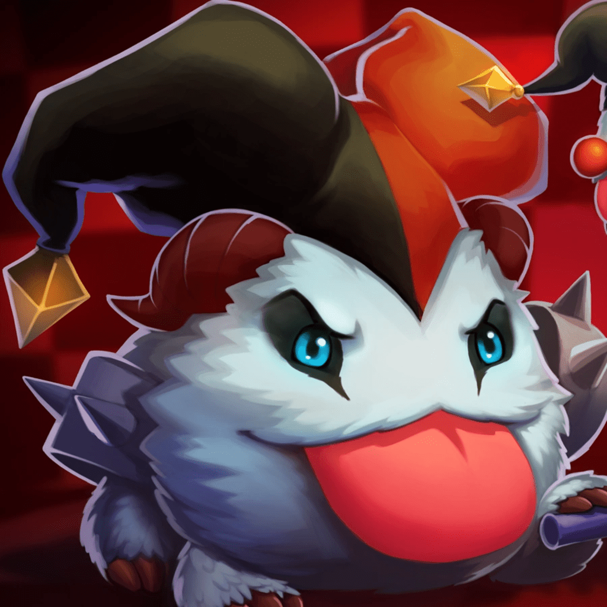

#  Dolos

Dolos is designed to act as a proxy between Riot Games' chat servers and a user's game client. Its primary feature is to enable users to appear offline in their games, preventing their friends from seeing their online status while still allowing the user to play in parties and to enjoy the gaming experience.

## Table of Contents
- [Features](#features)
- [Installation](#installation)
- [Usage](#usage)
- [Issues](#issues)
- [Contributing](#contributing)
- [License](#license)

## Features
- **Offline Mode:** Dolos allows users to play League of Legends or Valorant without appearing online to their friends, giving them the flexibility to control their visibility.
- **Easy Setup:** Simple setup with an easy to use and quick installer.
- **Simple Usage:** No configuration needed! Just run the app and it will do the rest.

## Installation

### The Easy Way
1. Navigate to the [releases page](https://github.com/Leastrio/Dolos/releases) and download the latest release (either the msi file or the exe file)

2. Run the installer

### Manual Building

Install Rust: https://www.rust-lang.org/tools/install\
Install Tauri Prerequisites: https://tauri.app/v1/guides/getting-started/prerequisites#setting-up-windows

1. Clone the repository:
    ```bash
    git clone https://github.com/Leastrio/Dolos.git
    ```

2. Navigate to the Dolos directory:
    ```bash
    cd Dolos
    ```

3. Install dependencies:
    ```bash
    cargo install tauri-cli
    ```

4. Build the app:
    ```bash
    cargo tauri build
    ```
    The app executable will be located at `target/release/Dolos.exe`\
    and the installer is located in `target/release/bundle/nsis`

## Usage

1. Close the riot client (this means fully by exiting through the tray icon, not just hitting the x on the riot client window)

2. Launch Dolos

3. From Dolos, launch either game 

## Issues

If you encounter any issues while using Dolos, please create an issue through [Github Issues](https://github.com/Leastrio/Dolos/issues) and make sure to thoroughly explain your issue. 

## Contributing

We welcome contributions from the community! If you have ideas for improvements or find issues, please submit a pull request or open an issue on the [GitHub repository](https://github.com/Leastrio/Dolos).

## License

This project is licensed under the [GNU General Public License v3.0](LICENSE), making it open and accessible for everyone.

---

> Dolos was created under Riot Games' "Legal Jibber Jabber" policy using assets owned by Riot Games.  Riot Games does not endorse or sponsor this project.